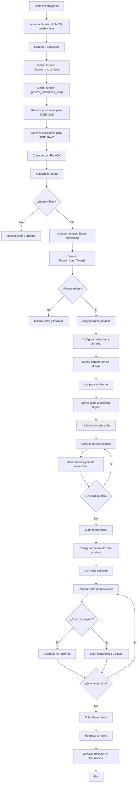

# Lab02 - Robótica Industrial - Analisis y Operaci´on del
Manipulador Motoman MH6.

  

# Integrantes

- [José Luis Pulido Fonseca](https://github.com/jpulidof)
- [Jairo David Díaz Luna](https://github.com/AxumII)

# Informe

## Índice

1. [Cuadro Comparativo: ABB IRB140 vs. Motoman MH6](#cuadro-comparativo-abb-irb140-vs-motoman-mh6)
2. [Descripción de configuraciones Home](#descripción-de-configuraciones-home)
3. [Modos de movimiento manuales](#modos-de-movimiento-manuales)
4. [Funcionalidades de RoboDK](#funcionalidades-de-robodk)
5. [Cuadro Comparativo: RoboDk vs RobotStudio](#cuadro-comparativo-robodk-vs-robotstudio)
6. [Diagrama de flujo](#diagrama-de-flujo)
7. [Plano de planta](#plano-de-planta)
8. [Código de RoboDK con trayectoria polar](#código-de-robodk-con-trayectoria-polar)
9. [Video de simulación de RoboDK](#video-de-simulación-de-robodk)

## Cuadro Comparativo: ABB IRB140 vs Motoman MH6

| Categoría | ABB IRB140 | Motoman MH6 |
| :--- | :--- | :--- |
| **Carga máxima** | 6 kg | 6 kg |
| **Alcance** | 810 mm (0.81 m) | 1,422 mm (1.42 m) |
| **Grados de Libertad** | 6 ejes | 8 ejes con Banda |
| **Velocidad Máxima (Eje 1 / Base)** | 200 °/s | 170 °/s |
| **Aplicaciones Típicas** | Ensamblaje, soldadura por arco, limpieza, manipulación de materiales y empaquetado. | Manipulación de materiales, ensamblaje, dispensado, empaquetado, mecanizado de alto nivel. |
| **Masa del Robot** | 98 kg | 130 kg |
| **Repetibilidad** | ±0.03 mm | ±0.08 mm |

## Descripcion de configuraciones Home
### 1. Home 1 (Absolute Home)
* **Posición de las articulaciones:** Todos los ejes se encuentran exactamente a 0° (posición de calibración y alineación de marcas físicas).
  * **S (Base):** 0°
  * **L (Brazo inferior):** 0°
  * **U (Brazo superior):** 0°
  * **R (Giro de muñeca):** 0°
  * **B (Inclinación de muñeca):** 0°
  * **T (Giro de la herramienta):** 0°
* **Descripción:** En esta configuración, el brazo adquiere su postura de calibración de fábrica. Físicamente, todas las marcas de alineación (flechas o muescas en el chasis de cada articulación) coinciden de manera perfecta.
* **Propósito:** Es una posición estricta de mantenimiento. Se utiliza exclusivamente para calibrar el robot, registrar los ceros absolutos de los motores y restablecer el sistema tras una pérdida de memoria (como una alarma *Out of Range*).

  

### 2. Home 2 (Work Home / Posición de Reposo o Trabajo)
* **Posición de las articulaciones:** A diferencia del Home 1, esta es una configuración **definida por el usuario** mediante programación, por lo que los ángulos varían según el diseño de la celda de trabajo. Típicamente, el brazo adopta una postura "plegada" sobre sí mismo (por ejemplo, con el eje L inclinado ligeramente, el eje U cerrado hacia abajo y la muñeca orientada al suelo para proteger la herramienta) aunque depende del entorno diseñado para el robot y las necesidades del usuario.
* **Descripción:** Es la postura segura de inicio, fin de ciclo y espera. El manipulador se retrae a un espacio predefinido donde no interfiere con el proceso.
* **Propósito:** Es el punto de partida seguro para ejecutar trayectorias automáticas y la posición de resguardo cuando el robot está inactivo.

  

## Modos de movimiento manuales
La operación manual del manipulador Motoman MH6 a través del Teach Pendant DX100 se divide fundamentalmente en dos tipos de movimiento: **Articular (Joint)** y **por Coordenadas (Cartesiano/Interpolado)**.

### Movimiento Articular (Joint)
En este modo, el usuario controla el ángulo de cada articulación de forma individual e independiente. El Teach Pendant dispone de 12 pulsadores físicos (6 pares de botones de `+` y `-`) que, en este modo, corresponden a la nomenclatura específica de los 6 ejes de Yaskawa: **S** (Base), **L** (Brazo inferior), **U** (Brazo superior), **R** (Giro de muñeca), **B** (Inclinación de muñeca) y **T** (Giro de la herramienta).

### Movimiento por Coordenadas (Cartesiano)
En los modos de interpolación, el movimiento se calcula para que el Punto Central de la Herramienta (TCP) describa una trayectoria lineal o controlada. Desde la perspectiva cinemática, y cumpliendo con el **criterio de Pieper**, el sistema de control del DX100 desacopla el cálculo en dos fases:
1. **Posicionamiento (Ejes Básicos):** Los primeros tres ejes (S, L, U) se encargan de llevar el centro de la muñeca a la coordenada espacial deseada $(X, Y, Z)$.
2. **Orientación (Ejes de Muñeca):** Los tres ejes finales (R, B, T) configuran una muñeca esférica que ajusta la orientación de la herramienta $(R_x, R_y, R_z)$ respecto al TCP. 

Al usar los mismos 12 pulsadores en modo cartesiano, el primer grupo de botones $(X\pm, Y\pm, Z\pm)$ controla la traslación lineal en el espacio, mientras que el segundo grupo controla la rotación espacial alrededor de dichos ejes, manteniendo el TCP en su posición.

### Sistemas de Referencia Disponibles
Para brindar versatilidad en la programación de trayectorias, el controlador DX100 permite conmutar entre múltiples sistemas de coordenadas:
* **Articular (Joint):** Movimiento eje por eje.
* **Cartesiano (Rectangular):** Basado en el sistema de referencia global en la base del robot.
* **Cilíndrico:** Movimiento basado en radio, ángulo y altura $(r, \theta, z)$.
* **Herramienta (Tool):** El sistema de referencia se ancla y orienta según el TCP actual.
* **Usuario (User):** Coordenadas personalizadas definidas por el operador mediante la enseñanza de 3 puntos en el espacio.

### Control de Velocidad Manual
Por seguridad y precisión durante el modo de enseñanza (Teach Mode), el Teach Pendant incluye un botón selector que permite alternar cíclicamente entre cuatro estados de velocidad límite para los movimientos manuales:
* **Inching (Paso a paso):** Movimiento extremadamente fino, ideal para aproximaciones críticas.
* **Low (Baja):** Velocidad reducida para trayectorias de alta precaución.
* **Medium (Media):** Velocidad estándar de operación manual.
* **High (Alta):** Velocidad máxima permitida en modo manual (restringida por normativas de seguridad frente a la velocidad real de operación automática).

## Funcionalidades de RoboDK

## Cuadro Comparativo: RoboDK vs. RobotStudio

| Categoría | RoboDK | RobotStudio |
| :--- | :--- | :--- |
| **Compatibilidad de Marcas** | **Multi-marca:** Soporta más de 50 fabricantes (ABB, Yaskawa/Motoman, Fanuc, KUKA, etc.). | **Exclusivo de ABB:** Diseñado específicamente para robots ABB. |
| **Lenguaje de Programación** | Basado en **Python**, C#, C++, y soporte para integración externa. | Basado en **RAPID** (lenguaje propietario de ABB). |
| **Fidelidad de Simulación** | Simulación cinemática y geométrica de alta precisión. | Máxima fidelidad. Utiliza el "Virtual Controller" idéntico al del hardware real. |
| **Programación Offline (OLP)** | Muy versátil; permite generar código para casi cualquier post-procesador. | Optimizado para ABB; permite la sincronización total entre la simulación y el controlador real. |
| **Costo y Licencia** | Licencia comercial más asequible y opción de licencia perpetua aunque la universidad NO TIENE. | Modelo de suscripción premium; la universidad SI TIENE LICENCIA. |
| **Curva de Aprendizaje** | **Baja/Media:** Interfaz intuitiva orientada a la facilidad de uso e integración con herramientas del lenguaje a elección. | **Alta:** Entorno profesional muy denso y restrictivo pero segmentado con un lenguaje incómodo. |
| **Post-procesadores y Flexibilidad** | **Muy Alta:** Permite modificar o crear post-procesadores fácilmente mediante scripts de Python para adaptar el código a formatos específicos (como los pulsos del controlador DX100 de Yaskawa). | **Baja (Fuera de ABB):** No genera código nativo ejecutable para controladores de otras marcas sin un ecosistema de conversión externo y complejo. |
| **Integración de Componentes de Celda (Track/Tornos)** | Fácil importación de archivos CAD tridimensionales y sincronización directa con mecanismos externos estándar como ejes lineales adicionales (*tracks*). | Excelente sincronización de sistemas de movimiento avanzados (MultiMove), pero fuertemente optimizada para el hardware periférico de la marca ABB. |
| **Concepto de Gemelo Digital** | Enfocado en la validación geométrica de trayectorias, alcances y evasión de colisiones espaciales mediante un entorno gráfico ágil. | Enfocado en el gemelo digital completo (lógica interna, tiempos de ciclo reales de escaneo, señales I/O idénticas y simulación de la física del controlador). |
| **Optimización de Trayectorias complejas** | Excelente para conversión directa de trayectorias complejas de manufactura (impresión 3D, maquinado CNC por G-code o trayectorias polares analíticas) a código robótico. | Excelente para programación estructurada de lógica industrial compleja, paletizado avanzado y control cinemático de alta precisión nativo de la marca. |
### Análisis para el Laboratorio
Dado qu

## Diagrama de flujo

## Plano de planta

## Código de RoboDK con trayectoria polar

## Video de simulación de RoboDK
[Ver en YouTube: Tutorial Motoman MH6 DX100](https://youtu.be/DAqCGlMtjmA)